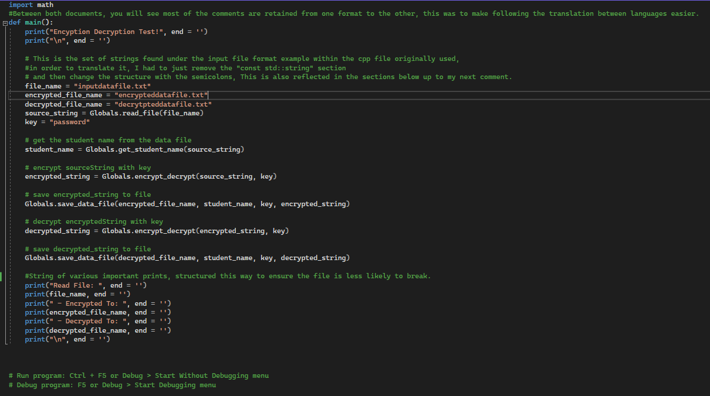
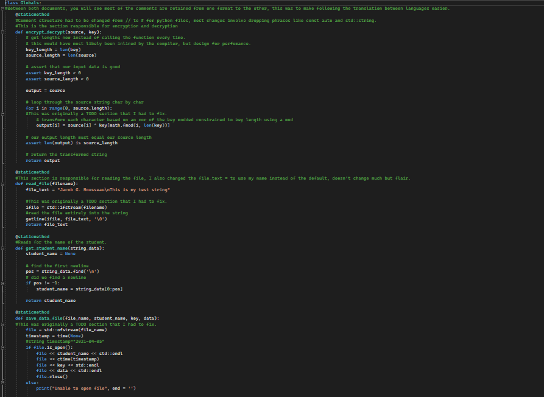
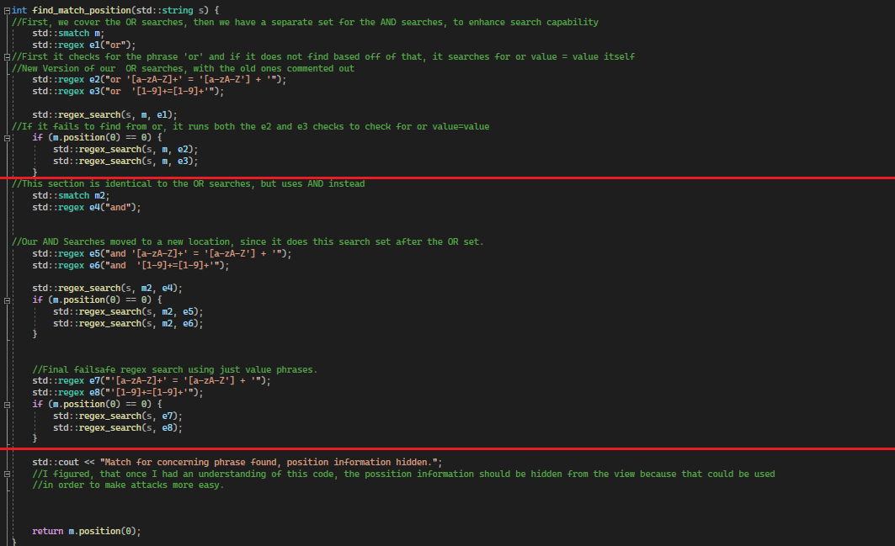
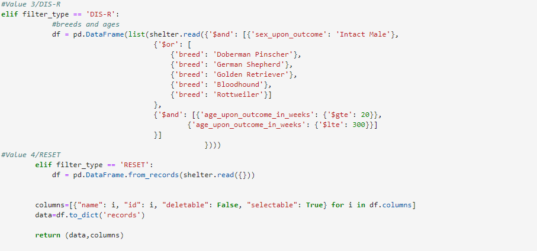
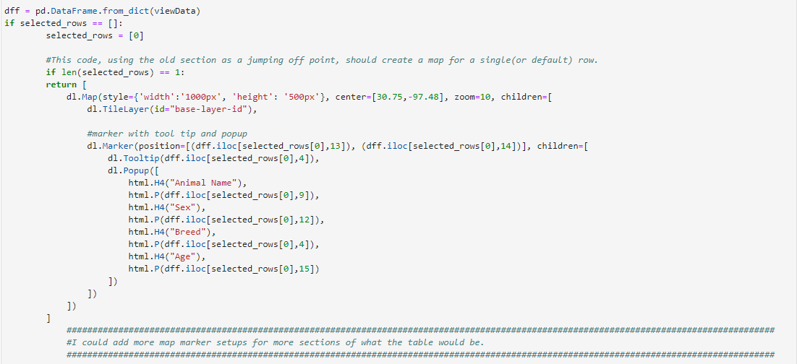
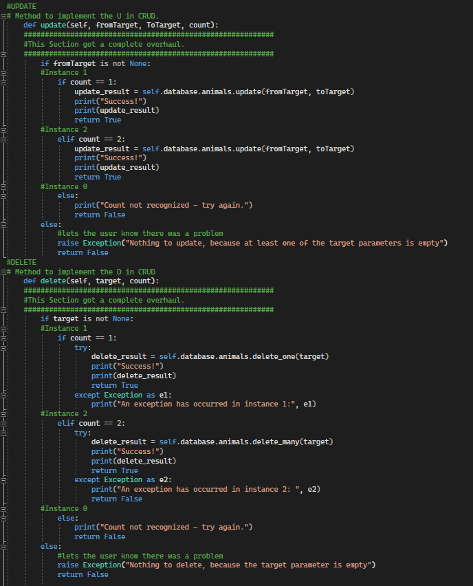

# Capstone Jacob Mousseau

For the capstone course, we have to show our competency with certain categories of work and how we can meet those goals, first and foremost, here is the code review video, Below it is a link to the script I used to guide myself, but it should not be 1 to 1 in this case. 

<h2>CODE REVIEW VIDEO IMAGE</h2>

<iframe width="560" height="315" src="https://www.youtube.com/embed/7VPagv84TxQ" title="YouTube video player" frameborder="0" allow="accelerometer; autoplay; clipboard-write; encrypted-media; gyroscope; picture-in-picture" allowfullscreen></iframe>

[Script](Code Review Script.rtf)

<h1>CATEGORY 1:</h1>
<h2>Enhancement: Software Design and Engineering</h2>
<h3>File Used: Encryption.cpp</h3>
[Narrative](Category 1 Narrative.rtf)

The full narrative is available at the link above, but, to give a run down, this file is from my 405 course. And the goal of it originally was to make sure I understood how to encrypt and decrypt files using code, by completing the TODO sections of the code. To enhance it, I modified the code TODO's to make them a bit more useful, before also translating it from C++ to Python, which also involved splitting the code into two files for better legibility.

A design flaw that is still present after these enhancements though, is the fact that the key is pretty obvious within the code itself, altough this is for testing our knowledge, it would be better for the key to be hidden more so, maybe within a separated file of it's own, that gets plugged in. While this allows us to use anything as our encryption key, if we were to use this particular code in a real world environment, it would be pointless to use because it gives us the key, it encrypts the input file, but then also decrypts it by itself. It would make more sense to have encryption and decryption as separated files. So my next goal if I continued to work on it would be to separate the functions into two files. Below is the code of the python files, the original CPP code can be found [here.](Encryption.cpp)

[Encryption PY](IMG Encryption PY.png)

[Globals PY](IMG Globals PY.png)

<h1>CATEGORY 2:</h1>
<h2>Enhancement: Algorithm and Data Structures</h2>
<h3>File Used: SQL Injection.cpp</h3>
[Narrative](CATEGORY 2 NARRATIVE.rtf)

Again, the full narrative is available above, but this is also from my 405 course, and the purpose of it initially was to teach us about SQL injections and how to deal with them, but the basis on how we dealt with them in the course was not very concrete and lacked security failsafes, which was part of my focus. Making sure my regex searches dealt with every facet I could think of. 

The first failsafe I decided to enhance and add, was heavily modified regex searching. Initially, it just searched for 'or' then if it didn't find that, it did 'and value=value' where that could be using letters or numbers. But this wasn't enough. I wanted it to search for 'or', and if for some reason it failed, search for 'or value=value', and then do the same process with 'and'. In the image below, the red lines separate the sections. From OR regex, to AND regex, to the return process.

[REGEX SEARCHES](REGEX SEARCHES.png)

There is also now more dummy data, as well as the additional injection tests to test with and phrases, since before it actually only tested with or phrases. We can also split up the tests between the old dummy data and the new additional dummy data.

<h1>CATEGORY 3:</h1>
<h2>Enhancement: Databases</h2>
<h3>File Used: JM_animals_CRUD_altered.py / JM_ProjectTwoDashboard(Resubmit).ipynb / NEW: ProjectTest.ipynb </h3>
[Narrative](Databases Narrative.rtf)

This file set had a lot of massive overhauls. I changed the way some values were named as well when overhauling code chunks to make it easier to read and understand. Firstly, in the dashboard ipynb, the on_click def has been completely removed, replaced with update_dashboard, which is a cleaner, more effective version of it. With the values each individually sectioned so you can tell what you are looking at more easily. Below is value 3 and 4, which are Disaster Rescue, and the RESET value, respectively.

[Dash 1](Dash 1.png)

I also restructured the chart generation to make it easier to read, but the general functionality is still the same from what it should be.

The biggest change is within the update_map definition. My original code structure is commented out there to showcase the difference between the setup and layout of the old and new versions. Another upside to the new version, is it's in theory, a tileable chunk of code, meaning I could copy and paste it to do maps for multiple rows instead of for a single/default row as shown in the comments. For the sake of readability and working on other enhancements, I only included the one instance:
 
[Dash 2](Dash 2.png)

The test file is a simple file that would test all the values in a real database setting. Which is written mostly from scratch, but was unable to be fully utilized.

For the python CRUD file, the Create and Read sections did not get very many updates, just some enhancment in making them make more sense and raise exceptions properly, although, the update and delete methods got complete overhauls as they were not fully designed in a way to complete their functions. 

[Dash 3](Dash 3.png)

